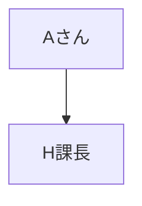

# パートナー名
A株式会社

## リレーションレベル
★★★

## 連係領域
* コンサルティング

## 連係目的
ネットワーク領域の強みを生かすため

## 連携先
●●さん

## URL
https://a.com

## 製品サービス
* 製品A-1
* 製品A-2

## 直近の実績
| 案件名 | 開始 | 終了 | 案件記録 |
| ---- | ---- | ---- | ---- |
| X社セキュリティコンサルティング | 2022.2 | 2023.1 | よく連携できた |
| Y社ネットワーク更改 | 2023.6 | 2023.12 | 品質が良くなかった |

## パートナー評価
| 年度 | 評価 | 理由 |
| ---- | ---- | ---- |
| 2022 | A+ | よく連携できた |
| 2023 | A- | 品質が良くなかった |

## 今後の関係性
* 維持

## 関係者との接点

